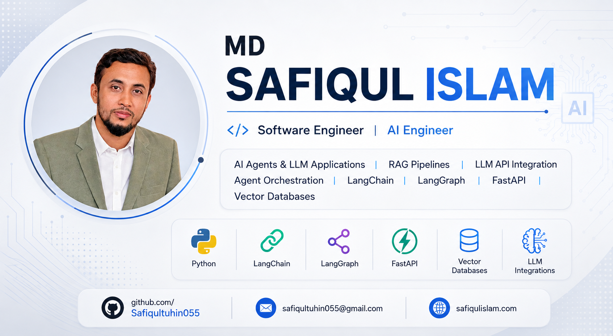

  

<h1 align="center">Hi, I'm MD Safiqul Islam 👋</h1>

  <b>Software Engineer</b> · <b>AI Engineer</b> 
  AI Agents &amp; LLM Applications · RAG Pipelines · LLM API Integration · Agent Orchestration

  
  
  

---

## 🧑‍💻 About Me

Software Engineer and AI Engineer building production-grade **AI agents and LLM applications** on top of solid backend and database engineering.

- 🤖 I design **AI agents & LLM applications** — tool use, function calling, multi-step reasoning.
- 🔎 I build **RAG pipelines**: chunking, embeddings, vector search, re-ranking, evaluation.
- 🔗 I handle **LLM API integration** and **agent orchestration** with LangChain and LangGraph.
- ⚡ I ship **FastAPI** services and **.NET / C#** backends with clean, testable architecture.
- 🗄️ I work across relational and NoSQL databases — Oracle, SQL Server, PostgreSQL, MySQL, MongoDB.
- 🧩 I also build enterprise apps with **Oracle APEX** and **PHP**.

📫 Reach me at **safiqultuhin055@gmail.com** · 🌐 **[safiqulislam.com](https://safiqulislam.com)**

---

## 🛠️ Skills

### AI &amp; LLM Engineering

`AI Agents & LLM Applications` · `RAG Pipelines` · `LLM API Integration` · `Agent Orchestration` · `Prompt Engineering` · `Embeddings & Semantic Search`

### Languages &amp; Frameworks

### Databases

`Oracle` · `SQL Server` · `PostgreSQL` · `MySQL` · `MongoDB` · `SQLite` · `Data Modeling` · `Query Optimization` · `Stored Procedures`

---

## 📊 GitHub Stats

  
  

---

## 📬 Contact

| | |
|---|---|
| 📧 Email | [safiqultuhin055@gmail.com](mailto:safiqultuhin055@gmail.com) |
| 🌐 Website | [safiqulislam.com](https://safiqulislam.com) |
| 💻 GitHub | [github.com/Safiqultuhin055](https://github.com/Safiqultuhin055) |

<i>Open to collaboration on AI agents, LLM applications, and RAG systems.</i>

